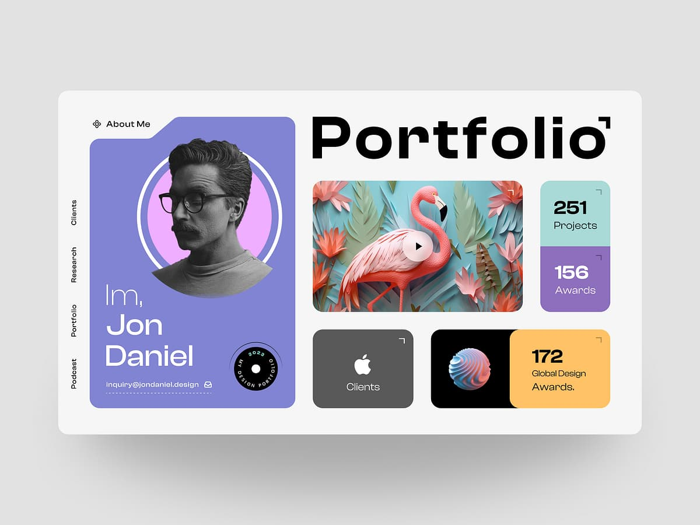

# Design Portfolio

A modern, responsive portfolio website showcasing my skills, projects, and professional experience as a designer and developer.



## Features

- **Interactive UI**: Modern design with animations and transitions
- **Dark/Light Mode**: Toggle between light and dark themes
- **Responsive Design**: Optimized for all device sizes
- **Project Showcase**: Detailed project cards with filtering options
- **Experience Timeline**: Professional history with detailed information
- **Skills Display**: Visual representation of technical and soft skills
- **Certificate Gallery**: Showcase professional certifications
- **GitHub Stats**: Real-time GitHub statistics integration

## Tech Stack

- **Frontend**: React.js, TypeScript, Framer Motion
- **Styling**: Tailwind CSS, CSS Modules
- **State Management**: React Context API
- **UI Components**: Custom components with Radix UI primitives
- **Animations**: Framer Motion for smooth transitions and effects
- **Data Visualization**: Recharts for stats display
- **Build Tool**: Vite

## Installation

1. Clone the repository:
   ```bash
   git clone https://github.com/Bhavneet-joshi/portfolio.git
   cd portfolio
   ```

2. Install dependencies:
   ```bash
   npm install
   ```
   
3. Run the development server:
   ```bash
   npm run dev
   ```

4. Open [http://localhost:5173](http://localhost:5173) in your browser.

## Build and Deployment

1. Build the project:
   ```bash
   npm run build
   ```

2. The build files will be in the `dist` directory.

3. Deploy to your preferred hosting platform:
   - GitHub Pages
   - Vercel
   - Netlify
   - Any static site hosting

## Project Structure

```
client/
├── public/           # Static assets
│   └── assets/       # Images and icons
├── src/
│   ├── components/   # React components
│   │   ├── portfolio/    # Portfolio-specific components
│   │   └── ui/           # Reusable UI components
│   ├── lib/          # Utilities and data
│   ├── pages/        # Page components
│   └── styles/       # Global styles
```

## Customization

1. Edit personal information in `src/lib/constants.ts`
2. Update projects in `src/lib/projects.ts`
3. Modify experience in `src/lib/experience.ts`
4. Replace certificate images in `public/assets/`
5. Adjust theme colors in `src/lib/theme-context.tsx`

## License

This project is licensed under the MIT License. 
